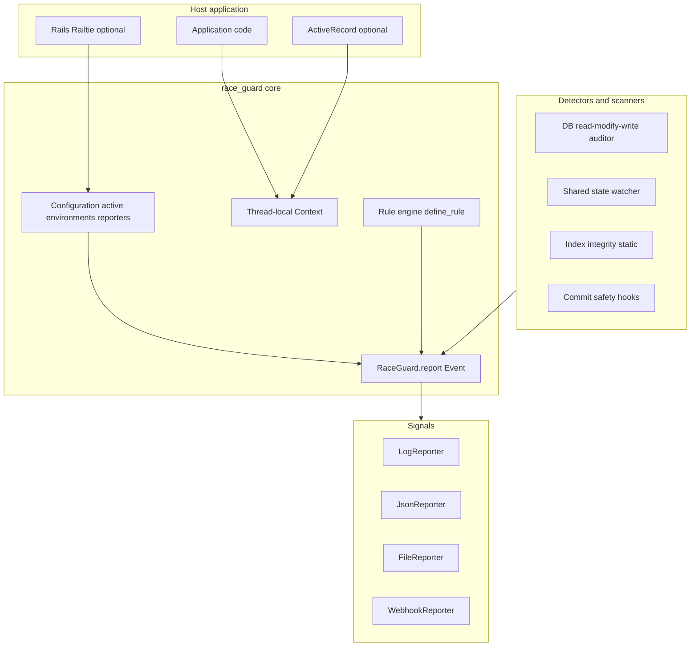

# race_guard

<p align="center">
  
</p>

`race_guard` helps detect **race conditions** in Ruby and Rails applications by combining static and runtime analysis behind an extensible API.

- **Principles (v0.1):** framework-agnostic core, safe-by-default, prefer low false positives, composable protection, and optional DSLs (see [`docs/specs.md`](https://github.com/ViniciusPuerto/race_guard/blob/main/docs/specs.md)).
- Source code and issue tracker: [github.com/ViniciusPuerto/race_guard](https://github.com/ViniciusPuerto/race_guard).

## The problem

Concurrent Ruby and Rails code often **reads state, decides in memory, and writes back** (read–modify–write), schedules work **outside** database transactions, or relies on **uniqueness validations** without matching unique indexes. Under load, two requests or jobs can interleave and produce **lost updates**, **double work**, or **duplicate rows**. `race_guard` gives you a single configuration surface, **thread-local context**, and **pluggable reporters** so those risks surface in development and CI—not only after production incidents.

## Quick start (under five minutes)

1. **Install** — `gem install race_guard` *or* add `gem "race_guard"` to your `Gemfile` and `bundle install`.
2. **Try reporting** — from the repo root after `bundle install`:

   ```bash
   bundle exec irb -Ilib -r race_guard
   ```

   Then:

   ```ruby
   require "stringio"
   log = StringIO.new
   RaceGuard.configure { |c| c.add_reporter(RaceGuard::Reporters::LogReporter.new(Logger.new(log))) }
   RaceGuard.report(detector: "demo", message: "hello from race_guard", severity: :info)
   puts log.string
   ```

   You should see a single log line with severity, detector, and message (defaults keep this active in **development** / **test** only).

3. **Optional: Rails demo** — a minimal app that triggers the read–modify–write detector lives under [`examples/rmw_rails_app`](examples/rmw_rails_app); see [`examples/README.md`](examples/README.md).

## Architecture (v0.1)

At a high level, the gem keeps **instrumentation** and **static analysis** behind a small runtime core: configuration, context, `RaceGuard.report`, and reporters. Optional integrations (ActiveRecord transaction mirroring, commit-safety interceptors, Rails Railtie) load only when you require them or when Rails boots.



## Requirements

- Ruby 3.1+

## Install

Add to your `Gemfile`:

```ruby
gem "race_guard"
```

Optionally pin a release:

```ruby
gem "race_guard", "~> 0.1"
```

Then run `bundle install`.

To install globally with RubyGems:

```bash
gem install race_guard
```

To use the latest revision from GitHub instead of the published gem:

```ruby
gem "race_guard", github: "ViniciusPuerto/race_guard", branch: "main"
```

## Configuration

`RaceGuard` keeps a per-process [configuration](https://github.com/ViniciusPuerto/race_guard/blob/main/lib/race_guard/configuration.rb) object. Use `RaceGuard.configure` or read `RaceGuard.configuration` / `RaceGuard.config` (aliases).

```ruby
require "race_guard"

RaceGuard.configure do |c|
  c.enable :db_lock_auditor
  c.severity :warn
end
```

- **`enable` / `disable`:** turn detectors on and off. Nothing is active until you call `enable`, so you can load the gem in production with no work unless you opt in and widen **environments** (below).
- **`severity`:** with one argument, sets the default level for all detectors. With two arguments, sets the level for a single detector (overrides the default for that name). Valid levels: `:info`, `:warn`, `:error`, `:raise`.
- **`environments`:** pass a list of `RACK_ENV` / `RAILS_ENV` names (as symbols) where race_guard may run. Default is **development and test only**; in **production** the config is *inactive* until you add `:production` (or otherwise include your deploy environment).

`ENV['RACK_ENV']` is read first, then `ENV['RAILS_ENV']` if the former is unset. If both are missing, the current environment is treated as `development` for that check.

| Setting | Default |
|--------|---------|
| Enabled detectors | None (all off until `enable`) |
| Default severity | `:info` |
| `environments` | `development`, `test` |
| Active in default production deploy | No (unless you add `production` to `environments`) |

Use `reset_configuration!` in tests or console to drop the cached singleton and start from defaults.

## Context

[`RaceGuard.context`](https://github.com/ViniciusPuerto/race_guard/blob/main/lib/race_guard/context.rb) exposes **thread-local** state: each Ruby thread has its own stack and transaction depth. Nothing is stored in a global `Thread` hash, so finished threads do not leave behind context entries.

- **`RaceGuard.context.current`** — immutable snapshot: `thread_id` (opaque `Thread.current.object_id`), `in_transaction` (true when nested `begin_transaction` depth is positive), `protected_blocks` (symbols, **outermost first** — first `push_protected` is index `0`, innermost is last), `current_rule` (reserved, always `nil` until the rule engine exists).
- **`push_protected` / `pop_protected`** — stack helpers; `pop` on an empty stack is a no-op.
- **`begin_transaction` / `end_transaction`** — nesting counter; extra `end_transaction` when depth is zero is a no-op.
- **`RaceGuard.context.reset!`** — clears context for the **current thread only** (use in tests; does not reset `RaceGuard.configuration`).

### ActiveRecord transactions (optional)

For Rails apps, you can mirror **`ActiveRecord::Base.transaction`** onto the same thread-local depth counter (`in_transaction?` becomes true for the duration of each nested `transaction` block, including **`requires_new: true`** inner blocks).

```ruby
require "active_record" # or load via Rails
require "race_guard"
require "race_guard/active_record" # prepends once; or call RaceGuard::ActiveRecord.install_transaction_tracking!

ActiveRecord::Base.transaction do
  RaceGuard.context.current.in_transaction? # => true
end
```

Core [`RaceGuard.context`](#context) already exposes **`begin_transaction` / `end_transaction`** for tests or non-AR code paths; the optional file wires ActiveRecord only. Implementation: [`lib/race_guard/active_record.rb`](https://github.com/ViniciusPuerto/race_guard/blob/main/lib/race_guard/active_record.rb).

### Commit safety interceptors (optional, Task 3.2)

After [`RaceGuard.configure`](#configuration) (active environment + reporters as needed), load and install hooks that emit **`RaceGuard.report`** events with detector names `commit_safety:active_job`, `commit_safety:action_mailer`, `commit_safety:net_http`, and `commit_safety:faraday`. Reporting and emitter logic are wrapped so **failures do not break the host app**.

```ruby
require "race_guard"
require "race_guard/interceptors"

RaceGuard::Interceptors.install_active_job!      # ActiveJob::Base.perform_later
RaceGuard::Interceptors.install_action_mailer! # ActionMailer::MessageDelivery#deliver_later
RaceGuard::Interceptors.install_net_http!      # Net::HTTP#request (requires "net/http")
RaceGuard::Interceptors.install_faraday!     # Faraday::Connection#run_request
# or RaceGuard::Interceptors.install_all! for each constant that is already loaded
```

- **ActionMailer:** the event is emitted **after** enqueue so Rails is not tripped by reading the message before `MailDeliveryJob` runs.
- **Faraday / ActiveJob:** require those libraries before calling the matching `install_*` method (or call `install_all!` once dependencies are loaded). Each `install_*` is idempotent per process.

Implementation: [`lib/race_guard/interceptors.rb`](https://github.com/ViniciusPuerto/race_guard/blob/main/lib/race_guard/interceptors.rb).

### Custom commit-safety watches (`watch_commit_safety`)

Register **your own** side-effect boundaries so they emit the same style of `commit_safety:*` events as the built-in interceptors, without wrapping calls in [`RaceGuard.protect`](#protection-raceguardprotect).

```ruby
RaceGuard.configure do |c|
  c.watch_commit_safety :custom do |w|
    w.intercept(MyClient, :call)
  end
end
```

- **`intercept(klass, method_name, scope: :auto)`** — same resolution rules as [`RaceGuard.watch`](#method-watch-raceguardwatch): only **public** methods **defined on** `klass` (not inherited-only); `:auto` prefers an instance method when both instance and singleton match.
- **Detector name** — events use `commit_safety:<name>` where `<name>` is the symbol or string you passed to `watch_commit_safety`.
- **Idempotent per watch** — the same `intercept` line does not double-prepend; you may register **different** watch names that wrap the same method (each emits once per call in prepend order).
- **Implementation:** [`lib/race_guard/commit_safety/watcher.rb`](https://github.com/ViniciusPuerto/race_guard/blob/main/lib/race_guard/commit_safety/watcher.rb).

### After successful transaction (`RaceGuard.after_commit`)

Run work **after** the current **ActiveRecord** `transaction` block finishes **without** raising (same nesting level). If the current thread is **not** in a transaction, the block runs **immediately**. Errors inside the block are **rescued** so they do not take down the host app.

```ruby
require "race_guard/active_record" # AR transaction patch + depth tracking

ActiveRecord::Base.transaction do
  RaceGuard.after_commit { enqueue_follow_up }
end
```

- **Prerequisite:** load [`race_guard/active_record`](#activerecord-transactions-optional) so `ActiveRecord::Base.transaction` drives `RaceGuard.context` depth and passes a **success** flag when the block completes. Without it, use [`begin_transaction` / `end_transaction`](#context) manually; deferred callbacks flush on `end_transaction(success: true)`.
- **Nesting:** inner frames flush first; a raised inner block discards that frame’s deferred callbacks while outer frames follow normal success/failure rules.
- **`RaceGuard.context.reset!`** clears deferred callbacks for the current thread (useful in tests).

Implementation: [`lib/race_guard/context.rb`](https://github.com/ViniciusPuerto/race_guard/blob/main/lib/race_guard/context.rb), [`lib/race_guard/active_record.rb`](https://github.com/ViniciusPuerto/race_guard/blob/main/lib/race_guard/active_record.rb), [`lib/race_guard.rb`](https://github.com/ViniciusPuerto/race_guard/blob/main/lib/race_guard.rb).

### DB read–modify–write (Epic 4.1) and lock awareness (4.2)

Opt-in **runtime** signal when a **configured** ActiveRecord model reads an attribute in the current thread, then a **successful** `save` / `save!` persists a change to that same attribute. Reports use detector **`db_lock_auditor:read_modify_write`**.

- **Requires** ActiveRecord and that you load the integration that prepends the patches, e.g. `require "race_guard/active_record"`.
- **Configure the model classes** to audit; untracked classes are not instrumented.
- **Semantics:** reads are tracked via `read_attribute` and `_read_attribute` (the path used by generated column readers). The write check runs **after** a successful `save`/`save!` using `saved_changes`. `update` / `update!` are covered because they end in `save`. Atomic SQL updates via `update_all("col = col +/- n")` are treated as safe for this detector and clear stale read-journal entries for affected rows.
- **Lock awareness (4.2):** if the same row is written under a pessimistic lock via `with_lock` (including nested) or `lock!` inside a tracked ActiveRecord `transaction` (as mirrored onto `RaceGuard.context` by the integration), the RMW report for that change is **suppressed** for that model; another tracked model in the same process can still report if it is not under an observed lock. Journal state for a row is cleared on `lock!` to avoid spurious RMW for reads taken before locking.
- **Thread-local journal** with a short TTL and max key count (see [`RaceGuard::Context::MutableStore`](https://github.com/ViniciusPuerto/race_guard/blob/main/lib/race_guard/context.rb)); reads in another thread do not correlate. `RaceGuard.context.reset!` clears the journal for the current thread and the read–modify–write “inside save” / read re-entrancy thread flags (so a stuck depth from a bad stack unwind in IRB does not skip read capture, which would make `rmw_read_age_ms_for` return nil and suppress reports).
- **Severity:** e.g. `c.severity(:'db_lock_auditor:read_modify_write', :warn)`.

```ruby
require "active_record"
require "race_guard"
require "race_guard/active_record" # prepends RMW + transaction patches

class Account < ApplicationRecord
end

RaceGuard.configure do |c|
  c.add_reporter(RaceGuard::Reporters::LogReporter.new(Logger.new($stdout)))
  c.db_lock_read_modify_write_models(Account) # or pass several classes
  c.severity(:'db_lock_auditor:read_modify_write', :warn)
end
```

Implementation: [`lib/race_guard/db_lock_auditor/read_modify_write.rb`](https://github.com/ViniciusPuerto/race_guard/blob/main/lib/race_guard/db_lock_auditor/read_modify_write.rb).

**Smoke test (IRB-quality scenarios, no `mtmpdir` typo):** from the repo root, with dev dependencies installed:

```bash
ruby script/smoke_db_lock_rmw.rb
# or: bundle exec ruby -Ilib script/smoke_db_lock_rmw.rb
```

The script prepends the repo `lib/` directory to `$LOAD_PATH`, so you do not need `-Ilib` when you run it from the repository root. It uses `require "tmpdir"` and `Dir.tmpdir` for a file-backed SQLite DB, asserts one RMW JSON line without a lock, then checks that `with_lock`, `lock!` in a transaction, nested `with_lock`, and two threads using `with_lock` produce **no** RMW lines and leaves balance **8** after two decrements.

### Index integrity (static, Epic 5)

**What it does:** finds ActiveRecord-style `validates … uniqueness:` declarations in Ruby source and checks that **each** one is backed by a **unique database index** whose columns match the validation’s `fields` plus optional `scope:` (set equality; column order on the index does not matter). This is **static analysis** only—it does not boot your app to run validations, and it does not detect runtime races by itself (for runtime RMW and locks, see **DB read–modify–write** under Epic 4 earlier in this README).

**Why it matters:** uniqueness in Ruby can pass twice under concurrency if the database does not enforce the same constraint (for example two Sidekiq jobs inserting the same logical key). A matching unique index closes that gap.

#### Rails app: full check (Epic 5.4)

1. Add `gem "race_guard"` to the `Gemfile` and run `bundle install`. Requiring `race_guard` registers [`RaceGuard::Railtie`](https://github.com/ViniciusPuerto/race_guard/blob/main/lib/race_guard/railtie.rb) whenever `railties` is present (no dependency on Gemfile order). The Railtie loads rake tasks and, once Active Record is loaded, installs transaction tracking and read–modify–write hooks (idempotent with any eager load path).

   **Optional initializer (Epic 8):** run `bin/rails generate race_guard:install` to create `config/initializers/race_guard.rb`, then edit `RaceGuard.configure` (reporters, feature flags, `environments`, etc.). Defaults keep **production** out of the active environment list unless you add it explicitly.

2. Ensure `db/schema.rb` exists (or rely on ActiveRecord: if the file is missing, the task uses `ActiveRecord::Base.connection` to list unique indexes).
3. Run:

```bash
bundle exec rake race_guard:index_integrity
```

- **Exit 0:** no missing unique indexes for any scanned uniqueness validation.
- **Exit non-zero:** at least one violation; STDOUT includes a suggested `add_index :table, [:col, …], unique: true` line per issue.

**Scanned layout:** all `app/models/**/*.rb` except paths under `app/models/concerns/`. Table names are inferred from the file path (for example `app/models/user.rb` → `:users`, `app/models/admin/user.rb` → `:admin_users`). Custom `self.table_name` is not read.

**CI:** run the same rake task in `RAILS_ENV=test` (or your CI env) after migrations or `schema:load`; no prompts.

#### Programmatic API (IRB, scripts, custom CI)

Use the same building blocks the rake task uses:

**5.1 — Model scanner** (Ruby source only; no Rails required):

```ruby
require "race_guard/index_integrity/model_scanner"

src = 'validates :slug, uniqueness: { scope: :account_id }'
RaceGuard::IndexIntegrity::ModelScanner.scan_source(src, filename: "app/models/page.rb")
# => [#<struct RaceGuard::IndexIntegrity::UniquenessValidation …>]

RaceGuard::IndexIntegrity::ModelScanner.scan_file("app/models/user.rb")
```

**5.2 — Schema analyzer** (`db/schema.rb` or a connection):

```ruby
require "race_guard/index_integrity/schema_analyzer"

RaceGuard::IndexIntegrity::SchemaAnalyzer.parse_file("db/schema.rb")
# => [#<struct RaceGuard::IndexIntegrity::IndexDefinition table=…, columns=[…], unique=true, name=…>, …]

# When AR is loaded and a connection exists (e.g. Rails console):
RaceGuard::IndexIntegrity::SchemaAnalyzer.from_connection(ActiveRecord::Base.connection)
```

**5.3 — Comparison** (validations + indexes):

```ruby
require "race_guard/index_integrity/model_scanner"
require "race_guard/index_integrity/schema_analyzer"
require "race_guard/index_integrity/comparison_engine"

v = RaceGuard::IndexIntegrity::ModelScanner.scan_file("app/models/user.rb")
idx = RaceGuard::IndexIntegrity::SchemaAnalyzer.parse_file("db/schema.rb")
RaceGuard::IndexIntegrity::ComparisonEngine.missing_indexes(validations: v, indexes: idx)
# => [] on success, or [#<RaceGuard::IndexIntegrity::MissingIndexViolation …>] with #message and #suggested_migration
```

**5.4 — One-shot runner** (same glob + schema path rules as the rake task; pass your app root):

```ruby
require "race_guard/index_integrity/runner"

RaceGuard::IndexIntegrity::Runner.exit_code_for(Rails.root, stdout: $stdout, stderr: $stderr)
# => 0 or 1
```

Use any `Pathname` to your application root (for example `Rails.root` in Rails).

**Limitations (v0.1):** partial unique indexes (`where:` in `schema.rb`) are skipped; `app/models/concerns/` is skipped; path-based table inference may not match non-conventional table names. Details: [`docs/specs.md`](https://github.com/ViniciusPuerto/race_guard/blob/main/docs/specs.md) (Epic 5).

Implementation: [`lib/race_guard/index_integrity/model_scanner.rb`](https://github.com/ViniciusPuerto/race_guard/blob/main/lib/race_guard/index_integrity/model_scanner.rb), [`lib/race_guard/index_integrity/schema_analyzer.rb`](https://github.com/ViniciusPuerto/race_guard/blob/main/lib/race_guard/index_integrity/schema_analyzer.rb), [`lib/race_guard/index_integrity/comparison_engine.rb`](https://github.com/ViniciusPuerto/race_guard/blob/main/lib/race_guard/index_integrity/comparison_engine.rb), [`lib/race_guard/index_integrity/runner.rb`](https://github.com/ViniciusPuerto/race_guard/blob/main/lib/race_guard/index_integrity/runner.rb), [`lib/race_guard/railtie.rb`](https://github.com/ViniciusPuerto/race_guard/blob/main/lib/race_guard/railtie.rb), [`lib/tasks/race_guard/index_integrity.rake`](https://github.com/ViniciusPuerto/race_guard/blob/main/lib/tasks/race_guard/index_integrity.rake).

### Shared mutable state (optional)

**What it is for:** catching unsafe **process-wide** mutation patterns—**class variables** (`@@x`), **globals** (`$x`), and **instance-variable memoization** written as `@cache ||= expensive_call` in code you choose to scan—when more than one thread can run your app (Puma workers, Sidekiq, concurrent-ruby executors, etc.). It complements row-level tools like **DB read–modify–write** (which tracks **per-record** attribute reads vs saves on configured models).

**Enable:**

```ruby
RaceGuard.configure do |c|
  c.enable(:shared_state_watcher)
  c.add_reporter(RaceGuard::Reporters::LogReporter.new(Logger.new($stderr)))
  # optional: tune severities
  c.severity(:'shared_state:conflict', :warn)
  c.severity(:'shared_state:memoization', :info)
end
```

**Runtime signals (when Ruby exposes them):** the gem installs a `TracePoint` for class- and global-variable **assignments** and normalizes each event into an internal `AccessEvent`. On **CRuby 3.x** today, public `TracePoint` does **not** offer those assignment events, so the listener is **not** installed and you see a **one-time** `Kernel.warn` explaining that—there is no slow global fallback. When a Ruby build accepts them, the same configuration starts receiving events without API changes.

**Conflict reporting:** when assignment events are available (or when you drive the same pipeline from tests), the tracker looks for **unprotected concurrent writes** to the same logical key from different threads, and **read/write overlap** when both reads and writes are observed. Accesses that run **inside** `Mutex#synchronize` (detected via the call stack) are treated as synchronized: they do not emit conflict reports for that pattern.

**Memoization scan:** opt in with one or more globs of Ruby files to scan for `@ivar ||= rhs`:

```ruby
RaceGuard.configure do |c|
  c.enable(:shared_state_watcher)
  c.shared_state_memo_globs("app/services/**/*.rb", "lib/my_gem/**/*.rb")
end
```

The scan is **static** (AST). Reports use detector **`shared_state:memoization`** and only fire after the process has started at least one **non-main** thread (a lightweight `thread_begin` hook), so single-threaded boot or one-off scripts stay quiet.

**Detectors and severities:**

| Detector | Meaning |
|----------|---------|
| `shared_state:conflict` | Concurrent writes or read/write overlap on a tracked shared key without an enclosing mutex (when events exist). |
| `shared_state:memoization` | A scanned `@ivar ||= …` site in a multi-threaded process. |

Override with `c.severity(:'shared_state:conflict', :warn)` and `c.severity(:'shared_state:memoization', :info)` as needed.

**Typical use cases:**

- Coordinating work through a **class variable** or **global** updated from a web thread and a background thread without a clear lock.
- A **singleton-style service** memoizing `@client ||= BigClient.new` in a file under your glob while jobs and HTTP handlers share the same process.

**Limitations (v0.1):** on current MRI, assignment `TracePoint` events are unavailable, so **automatic** cvar/gvar conflict detection does not run until the runtime supports it; memo scanning + `thread_begin` still work when globs are set. Mutex detection is stack-heuristic and may differ across Ruby versions. Deeper behavior and rationale: [`docs/specs.md`](https://github.com/ViniciusPuerto/race_guard/blob/main/docs/specs.md) (shared state section).

Implementation: [`lib/race_guard/shared_state/trace_point.rb`](https://github.com/ViniciusPuerto/race_guard/blob/main/lib/race_guard/shared_state/trace_point.rb), [`lib/race_guard/shared_state/watcher.rb`](https://github.com/ViniciusPuerto/race_guard/blob/main/lib/race_guard/shared_state/watcher.rb), [`lib/race_guard/shared_state/conflict_tracker.rb`](https://github.com/ViniciusPuerto/race_guard/blob/main/lib/race_guard/shared_state/conflict_tracker.rb), [`lib/race_guard/shared_state/mutex_stack.rb`](https://github.com/ViniciusPuerto/race_guard/blob/main/lib/race_guard/shared_state/mutex_stack.rb), [`lib/race_guard/shared_state/memo_scanner.rb`](https://github.com/ViniciusPuerto/race_guard/blob/main/lib/race_guard/shared_state/memo_scanner.rb), [`lib/race_guard/shared_state/memo_registry.rb`](https://github.com/ViniciusPuerto/race_guard/blob/main/lib/race_guard/shared_state/memo_registry.rb).

## Protection (`RaceGuard.protect`)

Wrap code so the thread-local context stack records a **named block** (used by future detectors and by reporting):

```ruby
RaceGuard.protect(:payment_flow) do
  # monitored
end
```

Nested `protect` calls push/pop in order (outermost block is first in `context.current.protected_blocks`). The block body runs between push and pop; **pop runs in `ensure`**, so the stack is restored even if the block raises.

When you call [`RaceGuard.report`](#reporting) inside an active `protect`, the event `context` hash is merged with **`protect`** (innermost block name as a string) and **`protect_stack`** (all nested names, outermost first).

Register optional hooks with `RaceGuard.configure { |c| c.add_protect_detector(obj) }` if `obj` responds to `on_protect_enter(name)` / `on_protect_exit(name)` (see [`RaceGuard::DetectorRuntime`](https://github.com/ViniciusPuerto/race_guard/blob/main/lib/race_guard/detector_runtime.rb)).

## Method watch (`RaceGuard.watch`)

Install a **prepend** wrapper so every call to a **public method defined directly** on the class or module runs inside [`RaceGuard.protect`](#protection-raceguardprotect) (same stack and reporting hooks as a manual `protect`):

```ruby
RaceGuard.watch(MyService, :call)
```

- **`scope:`** `:auto` (default) picks an **own** instance method if one exists on `klass`, otherwise an **own** singleton (class) method. If both exist, **instance wins**. Use `scope: :instance` or `scope: :singleton` to force.
- **Idempotent:** calling `watch` again for the same `klass`, method name, and owner is a no-op (no double wrap). Registration is guarded by a mutex so concurrent `watch` calls are safe.
- **v0.1 limitation:** only **public** methods declared **on that class** (`public_instance_methods(false)` / `singleton_class.public_instance_methods(false)`) are eligible; inherited-only methods are not matched by `:auto`.

Implementation: [`RaceGuard::MethodWatch`](https://github.com/ViniciusPuerto/race_guard/blob/main/lib/race_guard/method_watch.rb).

## Rules (`RaceGuard.define_rule`)

Register named rules with a **detect** / **message** pair and optional **hooks** on protect boundaries. Callbacks receive [`RaceGuard.context.current`](#context) (a frozen snapshot) and a **metadata** `Hash` with symbol keys (for example `event:`, `protect:`).

```ruby
RaceGuard.define_rule(:no_side_effects_in_txn) do |rule|
  rule.detect { |ctx, meta| ctx.in_transaction? }
  rule.message { |_ctx, _meta| "Side effect while in transaction" }
  rule.hook(:protect_enter) { |ctx, meta| # observe only }
  rule.run_on :protect_exit # when set, dispatch runs detect on these events
  rule.severity :warn       # optional; else `severity_for(:rule_name)` from config
end

RaceGuard.configure do |c|
  c.enable_rule :no_side_effects_in_txn
end
```

- **Enablement:** rules are **off** until `enable_rule` on [`RaceGuard::Configuration`](https://github.com/ViniciusPuerto/race_guard/blob/main/lib/race_guard/configuration.rb). In inactive environments (same rules as the rest of the gem), `enabled_rule?` is false even if the name was toggled on.
- **`run_on`:** if you omit it, `detect` / `message` are **not** run automatically from `protect`; use [`RaceGuard::RuleEngine.evaluate`](https://github.com/ViniciusPuerto/race_guard/blob/main/lib/race_guard/rule_engine.rb) from tests or future detectors. With `run_on :protect_enter` / `:protect_exit`, [`DetectorRuntime`](https://github.com/ViniciusPuerto/race_guard/blob/main/lib/race_guard/detector_runtime.rb) dispatches after each `protect` push/pop.
- **`hook`:** only `:protect_enter` and `:protect_exit` are supported in v0.1. Hook failures are swallowed so your app keeps running.
- **Registry:** duplicate rule names raise; tests can call `RaceGuard::RuleEngine.reset_registry!` to clear definitions (prepended modules from `watch` are separate).

Implementation: [`RaceGuard::RuleEngine`](https://github.com/ViniciusPuerto/race_guard/blob/main/lib/race_guard/rule_engine.rb), [`RaceGuard::Rule`](https://github.com/ViniciusPuerto/race_guard/blob/main/lib/race_guard/rule.rb).

## Reporting

`RaceGuard.report` delivers events to any number of [reporters](https://github.com/ViniciusPuerto/race_guard/blob/main/lib/race_guard/reporters/). The payload is a [`RaceGuard::Event`](https://github.com/ViniciusPuerto/race_guard/blob/main/lib/race_guard/event.rb); you can also pass a Hash with string or symbol keys (`detector`, `message`, `severity` required). See `RaceGuard::Event::SCHEMA` for the field contract.

- **`add_reporter` / `remove_reporter` / `clear_reporters`:** register objects responding to `report(event)`.
- **Built-in reporters:** `RaceGuard::Reporters::LogReporter` (stdlib Logger), `JsonReporter` (one JSON line per event to an IO), `FileReporter` (append JSONL to a path), `WebhookReporter` (POST JSON; failures are swallowed so your app is not taken down by a bad URL).

**Log lines:** `LogReporter` includes optional `location` on the main line; if you set `context: { "suggested_fix" => "…" }`, a second line logs that remediation (for operators and CI logs).

**JSON shape:** the NDJSON object contract is documented in [`docs/schemas/race_guard_report_event.json`](https://github.com/ViniciusPuerto/race_guard/blob/main/docs/schemas/race_guard_report_event.json) (required keys: `detector`, `message`, `severity`, `timestamp`, `context`).

**Severity `:raise`:** when the configuration is active, `RaceGuard.report(..., severity: :raise)` runs reporters then raises `RaceGuard::ReportRaisedError` with the event attached—useful in RSpec or strict pipelines to fail fast after logs/JSON are written.

`RaceGuard.report` does nothing when the configuration is **not** active in the current environment (same rules as the rest of the gem: default is development/test only).

```ruby
RaceGuard.configure do |c|
  c.add_reporter RaceGuard::Reporters::LogReporter.new(Logger.new($stderr))
  c.add_reporter RaceGuard::Reporters::JsonReporter.new($stdout)
end

RaceGuard.report(detector: "demo", message: "hello", severity: :warn, location: "app.rb:1")
```

### Try it in `irb`

In an app that already lists `race_guard` in the `Gemfile`, use `bundle exec irb -r race_guard`.

When developing the gem from a git clone, from the repository root use `bundle exec irb -Ilib -r race_guard`.

1. **Reset and set dev** — `RaceGuard.reset_configuration!` then `ENV["RACK_ENV"] = "development"` (or leave unset; it defaults to `development`).
2. **Register reporters** — e.g. `log_io = StringIO.new; RaceGuard.configure { |c| c.add_reporter(RaceGuard::Reporters::LogReporter.new(Logger.new(log_io))) }` (in plain IRB use a real `Logger` to `$stdout` or a file if you do not have `StringIO` loaded: `require "stringio"` first).
3. **Report** — `RaceGuard.report(detector: "a", message: "b", severity: :info)`; inspect your IO or `log_io.string`.
4. **File line** — `RaceGuard.reset_configuration!`; `require "tmpdir"; p = File.join(Dir.tmpdir, "rg.jsonl")` then `configure { |c| c.add_reporter(RaceGuard::Reporters::FileReporter.new(p)) }` and `RaceGuard.report(...)`; `File.read(p)`. (Use `Dir.tmpdir`, not `Dir.mtmpdir`.)
5. **Production no-op** — `ENV["RACK_ENV"] = "production"`, re-add a `JsonReporter` to `$stdout`, run `report`; you should see no new output, then `ENV.delete("RACK_ENV")` and `RaceGuard.reset_configuration!`.

## Development

```bash
bundle install
bundle exec rspec
bundle exec rubocop
ruby script/smoke_db_lock_rmw.rb   # DB lock RMW + lock awareness (optional)
rake   # RSpec + RuboCop
```

OSS-oriented **Rails demo** (read–modify–write): [`examples/README.md`](examples/README.md).

To build and install the gem from your checkout into your RubyGems user directory:

```bash
bundle exec rake install
```

## Contributing

Please read [CONTRIBUTING.md](https://github.com/ViniciusPuerto/race_guard/blob/main/CONTRIBUTING.md). For conduct expectations see [CODE_OF_CONDUCT.md](https://github.com/ViniciusPuerto/race_guard/blob/main/CODE_OF_CONDUCT.md). To report a security issue, use [SECURITY.md](https://github.com/ViniciusPuerto/race_guard/blob/main/SECURITY.md) (do not use public issues). Release history: [CHANGELOG.md](https://github.com/ViniciusPuerto/race_guard/blob/main/CHANGELOG.md).

## License

MIT — see [LICENSE.txt](https://github.com/ViniciusPuerto/race_guard/blob/main/LICENSE.txt).
